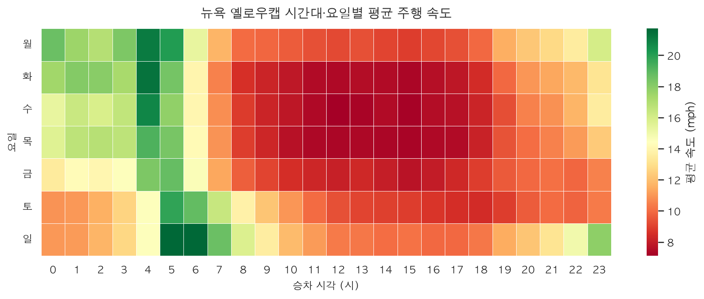
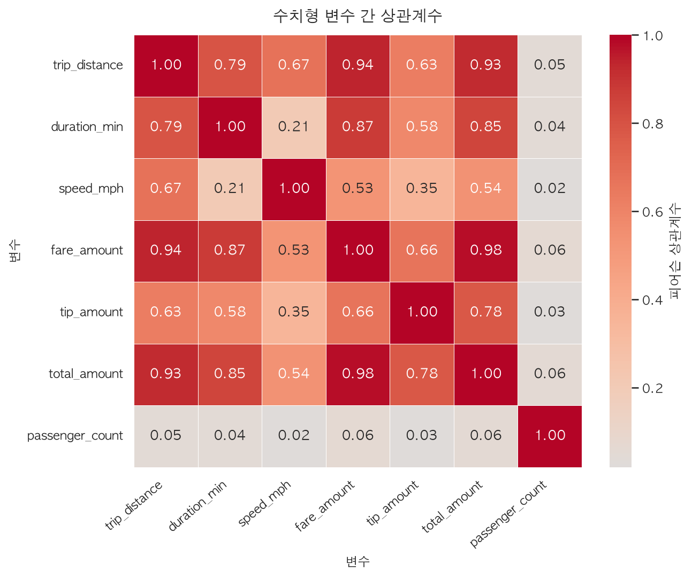
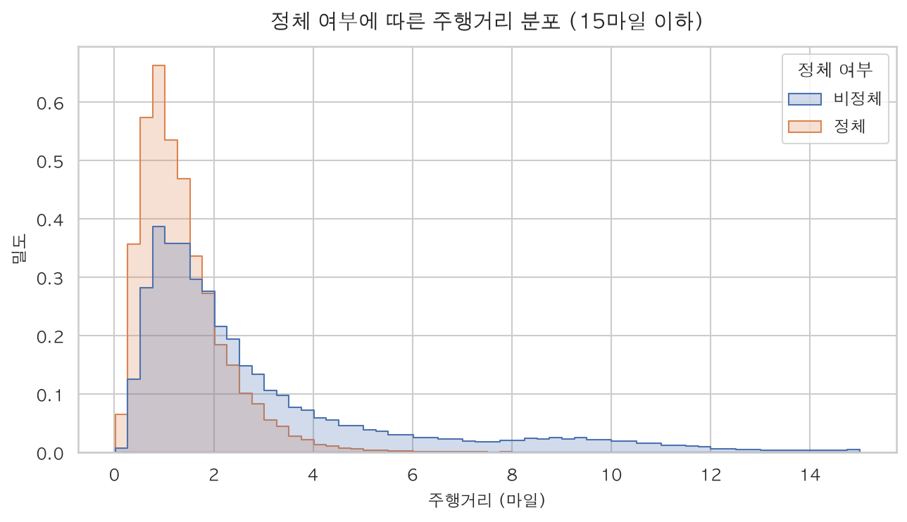

# 뉴욕 옐로우캡 정체 예측 분석 보고서

> 이 문서는 `main.py` 실행 시 `src/report.py`가 자동 생성합니다.

- **생성 일시** : 2026-08-07 17:33:46
- **작성자** : 판교 10반 박유진
- **데이터** : NYC TLC Yellow Taxi 2026년 5월 (4,090,836행 × 20열)
- **난수 시드** : 42 (재현 가능)

## 분석 목표

승차 시점에 알 수 있는 정보(승차 시각·요일·출발/도착 존·예상 주행거리·승객 수)만으로
해당 트립이 **정체 구간에 걸릴지** 예측한다.
소요시간·요금·팁처럼 하차 후에야 확정되는 값은 타깃 누수를 일으키므로 피처에서 제외했다.

정체의 정의는 하나로 정하지 않고 **두 가지를 함께 학습해 비교**한다.

- **절대정체(jam_abs)** : 전체 트립 평균 속도 분포의 하위 33%
- **상대정체(jam_rel)** : 동일 경로(출발존→도착존)의 평소 중앙 속도 대비 하위 33%

## 1. 데이터 준비 — Pandas / Polars 이중 로딩

동일한 parquet 파일을 두 라이브러리로 읽어 결과가 일치하는지 검증했다.

| 방식 | 소요 시간(초) |
|---|---|
| Pandas `read_parquet` | 0.140 |
| Polars `read_parquet` (Eager) | 0.050 |
| Polars `scan_parquet` (Lazy, 필요 컬럼만) | 0.071 |

Polars가 Pandas 대비 **2.78배** 빠르게 읽었다.

### 결과 일치 검증

- 행/열 개수 일치 : **True**
- 컬럼별 결측 수 일치 : **True** (전체 결측 4,776,855건)

### 분위수 계산 시 주의점

Polars의 `quantile` 기본 보간법은 `nearest`, Pandas는 `linear`이다.
옵션을 맞추지 않으면 같은 데이터에서도 분위수가 달라진다.

| 분위수 | pandas(linear) | polars(기본=nearest) | polars(linear 명시) |
|---|---|---|---|
| 25% | 1.0400 | 1.0400 | 1.0400 |
| 50% | 1.8700 | 1.8700 | 1.8700 |
| 75% | 3.8100 | 3.8100 | 3.8100 |

이 컬럼에서는 두 보간법의 결과가 일치했으나, 일반적으로는 명시가 필요하다.

### 동일 집계 대조 — Polars Lazy vs Pandas

같은 집계(승객 수별 평균·중앙 속도)를 두 방식으로 수행해 결과를 대조했다.
Polars는 `scan_parquet`으로 실행 계획을 세운 뒤 필터·집계까지 Lazy로 구성하고
`collect()` 시점에 한 번에 실행한다.

- Polars `scan_parquet` + `group_by` : 0.071초
- Pandas `groupby` : 0.145초
- Lazy 집계가 **2.04배** 빠르다 (필요한 6개 컬럼만 읽기 때문)

| 승객 수 | 트립수_pandas | 평균속도_pandas | 중앙속도_pandas | 트립수_polars | 평균속도_polars | 중앙속도_polars |
|---|---|---|---|---|---|---|
| 0.0 | 12082.000 | 10.655 | 8.475 | 12082.000 | 10.655 | 8.475 |
| 1.0 | 2507957.000 | 10.197 | 8.555 | 2507957.000 | 10.197 | 8.555 |
| 2.0 | 384083.000 | 10.643 | 8.769 | 384083.000 | 10.643 | 8.769 |
| 3.0 | 81352.000 | 10.190 | 8.464 | 81352.000 | 10.190 | 8.464 |
| 4.0 | 49873.000 | 11.336 | 8.589 | 49873.000 | 11.336 | 8.589 |
| 5.0 | 7599.000 | 10.003 | 8.963 | 7599.000 | 10.003 | 8.963 |
| 6.0 | 4532.000 | 10.383 | 9.089 | 4532.000 | 10.383 | 9.089 |
| 8.0 | 1.000 | 3.227 | 3.227 | 1.000 | 3.227 | 3.227 |
| nan | nan | nan | nan | 879400.000 | 38.570 | 10.314 |

**두 결과의 그룹 수가 다르다** — Pandas 8개, Polars 9개.

Pandas의 `groupby`는 그룹 키가 결측인 행을 **기본적으로 제외**하지만,
Polars의 `group_by`는 null을 **하나의 그룹으로 유지**한다.
이 데이터에서는 **879,400건**이 그 차이에 해당한다.

즉 Pandas만 썼다면 이 88만 건이 집계에서 조용히 빠진 것을 알아채지 못했을 것이다.
두 결과를 맞추려면 Pandas에 `dropna=False`를 주거나, 집계 전에 그룹 키의 결측을
명시적으로 제거해야 한다.

이 null 그룹이 곧 2장에서 다루는 **구조적 결측 블록**이다.
표의 평균속도가 중앙속도보다 훨씬 큰 것은 이 집계가 정제 전 원본을 대상으로 해
이상치가 남아 있기 때문이며, 이상치 제거는 2장에서 수행한다.

## 2. 결측치·중복·이상치 처리

### 2-1. 결측 진단 — 무작위 결측이 아니었다

| 컬럼 | 결측 수 | 비율(%) |
|---|---|---|
| `passenger_count` | 955,371 | 23.354 |
| `RatecodeID` | 955,371 | 23.354 |
| `store_and_fwd_flag` | 955,371 | 23.354 |
| `congestion_surcharge` | 955,371 | 23.354 |
| `Airport_fee` | 955,371 | 23.354 |

**핵심 발견** — 위 5개 컬럼(`passenger_count`, `RatecodeID`, `store_and_fwd_flag`, `congestion_surcharge`, `Airport_fee`)의 결측 위치가 서로 **완전히 일치**한다.
해당 블록의 크기는 **955,371행(23.4%)** 이다.

즉 값이 개별적으로 빠진 것이 아니라, **특정 데이터 소스가 해당 필드를 통째로 비운 것**이다.
이 경우 평균·최빈값 대체는 존재하지 않는 값을 지어내는 셈이므로 적절하지 않다.

이를 뒷받침하는 근거로, 블록 안팎의 벤더 구성이 서로 겹치지 않는다.

| VendorID | 결측 블록 | 나머지 |
|---|---|---|
| 1 | 123169 | 682052 |
| 2 | 824559 | 2401663 |
| 6 | 7643 | 0 |
| 7 | 0 | 51750 |

- 결측 블록에만 존재하는 벤더 : [6]
- 나머지 구간에만 존재하는 벤더 : [7]

따라서 이 블록은 대체하지 않고 **제거**하기로 결정했다.

### 2-2. NaN이 아닌 '코드값 결측'

NYC TLC 데이터는 '알 수 없음'을 NaN이 아니라 약속된 코드값으로 기록한다.
`isna()`만으로는 잡히지 않으므로 별도로 진단했다.

| 항목 | 행수 | 비율(%) | 처리 |
|---|---|---|---|
| RatecodeID == 99 (unknown) | 140897 | 3.444 | 유지 — 별도 범주로 학습 |
| 출발/도착 존이 (264, 265) (Unknown/NA) | 25260 | 0.617 | 제거 — 존이 핵심 피처라 미상은 사용 불가 |

`RatecodeID = 99`는 제거하지 않았다. '미상'이라는 사실 자체가 정보이며,
보조 피처이므로 별도 범주로 두면 나머지 피처로 예측이 가능하기 때문이다.

### 2-3. 단계별 처리 이력

제거 순서는 의존 관계를 따른다. 소요시간을 먼저 걸러야 0으로 나누지 않고
평균 속도를 계산할 수 있으므로, 속도 기반 필터가 뒤에 온다.

| 처리 단계 | 제거 행수 | 남은 행수 |
|---|---|---|
| 분석 대상 컬럼의 결측치 | 955,371 | 3,135,465 |
| 완전 중복행 | 0 | 3,135,465 |
| 관측 기간(2026-05) 밖 승차 시각 | 14 | 3,135,451 |
| 소요시간 1분 미만 / 180분 초과 | 92,470 | 3,042,981 |
| 평균속도 1mph 미만 / 70mph 초과 | 12,774 | 3,030,207 |
| 요금 0 이하 | 12,424 | 3,017,783 |
| 주행거리 50마일 초과 | 389 | 3,017,394 |
| 출발/도착 존 미상 (264, 265) | 19,150 | 2,998,244 |
| 출발=도착인데 10마일 초과 | 284 | 2,997,960 |

- 중복행 : 0건

## 3. 정체 타깃 정의

| 항목 | 절대정체 (`jam_abs`) | 상대정체 (`jam_rel`) |
|---|---|---|
| 기준 | 전체 평균속도 하위 33% | 동일 경로 평소 속도 대비 하위 33% |
| 임계값 | 7.05 mph | 평소 속도의 86.4% |
| 정체 비율 | 34.3% | 33.3% |

- 상대정체는 표본 30건 이상인 경로 **5,078개**를 기준으로 계산했다.
- 두 정의가 같은 판정을 내린 비율 : **81.5%**

### 두 타깃이 실제로 잡아내는 트립

|  | 중앙 거리(mi) | 중앙 소요(분) | 중앙 속도(mph) | 1마일 미만 비중(%) |
|---|---|---|---|---|
| 절대정체 | 1.18 | 14.17 | 5.43 | 39.22 |
| 상대정체 | 1.50 | 17.95 | 5.62 | 29.52 |

절대정체는 **1마일 미만 단거리 비중이 뚜렷하게 높다**. 맨해튼 도심의 짧은 트립은
교통 상황과 무관하게 원래 느리기 때문이다. 즉 절대정체는 '교통 정체'뿐 아니라
'도심 단거리라는 트립 성격'을 함께 잡는다.
상대정체는 경로별 평소 속도를 기준으로 삼아 이 성격을 통제하므로,
'같은 길인데 오늘 유독 느렸다'는 의미에 더 가깝다.

## 4. 통계 분석

### 4-1. 기술통계 (평균·표준편차·분위수)

| 변수 | 건수 | 평균 | 표준편차 | 최솟값 | 25% | 중앙값 | 75% | 최댓값 |
|---|---|---|---|---|---|---|---|---|
| trip_distance | 2841553.000 | 3.057 | 3.983 | 0.020 | 1.000 | 1.640 | 3.000 | 47.660 |
| duration_min | 2841553.000 | 17.026 | 13.803 | 1.000 | 7.967 | 13.117 | 21.300 | 179.983 |
| speed_mph | 2841553.000 | 9.808 | 5.767 | 1.000 | 6.216 | 8.451 | 11.523 | 69.751 |
| fare_amount | 2841553.000 | 18.815 | 15.875 | 0.010 | 9.300 | 13.500 | 21.200 | 615.000 |
| tip_amount | 2841553.000 | 3.791 | 3.867 | 0.000 | 1.740 | 3.030 | 4.710 | 222.000 |
| total_amount | 2841553.000 | 28.648 | 20.752 | 1.010 | 16.800 | 21.900 | 30.780 | 623.000 |
| passenger_count | 2841553.000 | 1.248 | 0.640 | 0.000 | 1.000 | 1.000 | 1.000 | 8.000 |

### 4-2. 변수 간 상관계수 (피어슨)

| 변수 | trip_distance | duration_min | speed_mph | fare_amount | tip_amount | total_amount | passenger_count |
|---|---|---|---|---|---|---|---|
| trip_distance | 1.000 | 0.792 | 0.674 | 0.938 | 0.629 | 0.927 | 0.050 |
| duration_min | 0.792 | 1.000 | 0.206 | 0.875 | 0.579 | 0.848 | 0.044 |
| speed_mph | 0.674 | 0.206 | 1.000 | 0.532 | 0.350 | 0.535 | 0.019 |
| fare_amount | 0.938 | 0.875 | 0.532 | 1.000 | 0.663 | 0.978 | 0.059 |
| tip_amount | 0.629 | 0.579 | 0.350 | 0.663 | 1.000 | 0.776 | 0.026 |
| total_amount | 0.927 | 0.848 | 0.535 | 0.978 | 0.776 | 1.000 | 0.056 |
| passenger_count | 0.050 | 0.044 | 0.019 | 0.059 | 0.026 | 0.056 | 1.000 |

평균 속도와 상관이 큰 변수는 다음과 같다.

| 변수 | 상관계수 | 절댓값 |
|---|---|---|
| trip_distance | 0.674 | 0.674 |
| total_amount | 0.535 | 0.535 |
| fare_amount | 0.532 | 0.532 |
| tip_amount | 0.350 | 0.350 |
| duration_min | 0.206 | 0.206 |

주행거리와 평균 속도의 상관이 높은 것은, 장거리 트립이 고속도로를 이용해
빠르고 단거리 트립은 도심 신호에 걸려 느리기 때문이다.

### 4-3. 시간대별 속도

- 가장 느린 시간대 : **15시 (8.16 mph)**
- 가장 빠른 시간대 : **5시 (19.21 mph)**
- 속도 격차 : **2.35배**

### 4-4. t-test 및 p-value 해석

표본 크기가 다르고 등분산을 가정할 수 없으므로 Welch's t-test
(`scipy.stats.ttest_ind(equal_var=False)`)를 사용했다. 유의수준은 α = 0.05이다.

#### 정체 여부에 따른 주행거리(마일) 차이

- 귀무가설 : 정체 트립과 비정체 트립의 평균은 같다
- 정체 트립 : n = 974,355, 평균 = 1.388
- 비정체 트립 : n = 1,867,198, 평균 = 3.927
- t = -721.3026, p = 0.0000e+00
- **해석** : p = 0.0000e+00 < α = 0.05 이므로 귀무가설을 기각한다. 두 집단의 평균 차이는 통계적으로 유의하다.

#### 주말/평일에 따른 평균 속도(mph) 차이

- 귀무가설 : 주말과 평일의 평균은 같다
- 주말 : n = 837,315, 평균 = 10.736
- 평일 : n = 2,004,238, 평균 = 9.420
- t = 170.9955, p = 0.0000e+00
- **해석** : p = 0.0000e+00 < α = 0.05 이므로 귀무가설을 기각한다. 두 집단의 평균 차이는 통계적으로 유의하다.

#### 출퇴근 시간대 여부에 따른 평균 속도(mph) 차이

- 귀무가설 : 출퇴근 시간대와 그 외 시간대의 평균은 같다
- 출퇴근 시간대 : n = 1,066,579, 평균 = 9.250
- 그 외 시간대 : n = 1,774,974, 평균 = 10.143
- t = -132.6670, p = 0.0000e+00
- **해석** : p = 0.0000e+00 < α = 0.05 이므로 귀무가설을 기각한다. 두 집단의 평균 차이는 통계적으로 유의하다.

## 5. 시각화 산출물

모든 차트에 제목과 축 레이블을 포함했다.

### Seaborn 정적 차트







### Plotly 인터랙티브 차트

- [figures/04_hourly_speed_plotly.html](figures/04_hourly_speed_plotly.html) — 브라우저에서 열면 확대·툴팁 확인 가능
- [figures/05_zone_jam_rate_plotly.html](figures/05_zone_jam_rate_plotly.html) — 브라우저에서 열면 확대·툴팁 확인 가능

## 6. ML Pipeline

### 6-1. 파이프라인 구성

```
Pipeline
 ├─ preprocess : ColumnTransformer
 │   ├─ numeric     : SimpleImputer(median) → StandardScaler
 │   └─ categorical : SimpleImputer(most_frequent) → OneHotEncoder
 └─ classifier : RandomForestClassifier
```

전처리를 Pipeline 안에 넣었기 때문에, 학습 데이터에서 구한 통계값(중앙값·평균·분산)이
테스트 데이터에 그대로 적용된다. 전처리를 Pipeline 밖에서 미리 수행하면 테스트 데이터의
정보가 학습에 새어드는 **데이터 누수**가 발생한다.

존 ID(`PULocationID`, `DOLocationID`)는 정수로 저장돼 있지만 숫자의 크기에 의미가 없는
명목형이므로 범주형으로 취급해 원-핫 인코딩했다.

학습 표본은 200,000행이며, 층화 추출로 8:2 분할했다.

### 6-2. 성능 비교

| 타깃 | 정의 | 정확도 | F1(macro) | 기준선 F1 | F1 개선 | 학습(초) |
|---|---|---|---|---|---|---|
| jam_abs | 절대정체 (전체 트립 평균속도 하위 33%) | 0.7964 | 0.7651 | 0.3966 | 0.3685 | 3.8000 |
| jam_rel | 상대정체 (동일 경로 평소 속도 대비 하위 33%) | 0.7339 | 0.6575 | 0.4002 | 0.2573 | 3.9000 |

기준선은 항상 최빈 클래스만 예측하는 `DummyClassifier`이다.
정확도만 보면 불균형 데이터에서 기준선이 높게 나오므로, **F1(macro) 개선폭**을 함께 봐야
모델이 실제로 학습했는지 판단할 수 있다.

### 6-3. `jam_abs` 상세 — 절대정체 (전체 트립 평균속도 하위 33%)

- 전처리 후 피처 수 : 193개
- 학습 시간 : 3.8초
- 정확도 : 0.7964 / F1(macro) : 0.7651

```
              precision    recall  f1-score   support

         비정체     0.8205    0.8833    0.8508     26290
          정체     0.7378    0.6295    0.6794     13710

    accuracy                         0.7964     40000
   macro avg     0.7792    0.7564    0.7651     40000
weighted avg     0.7922    0.7964    0.7920     40000
```

혼동 행렬

|  | 예측 비정체 | 예측 정체 |
|---|---|---|
| 실제 비정체 | 23223 | 3067 |
| 실제 정체 | 5079 | 8631 |

- 저장된 모델 : `outputs/models/jam_model_jam_abs.pkl`

### 6-3. `jam_rel` 상세 — 상대정체 (동일 경로 평소 속도 대비 하위 33%)

- 전처리 후 피처 수 : 191개
- 학습 시간 : 3.9초
- 정확도 : 0.7339 / F1(macro) : 0.6575

```
              precision    recall  f1-score   support

         비정체     0.7491    0.9039    0.8192     26688
          정체     0.6710    0.3931    0.4958     13312

    accuracy                         0.7339     40000
   macro avg     0.7100    0.6485    0.6575     40000
weighted avg     0.7231    0.7339    0.7116     40000
```

혼동 행렬

|  | 예측 비정체 | 예측 정체 |
|---|---|---|
| 실제 비정체 | 24122 | 2566 |
| 실제 정체 | 8079 | 5233 |

- 저장된 모델 : `outputs/models/jam_model_jam_rel.pkl`

## 7. 결론

1. **승차 시점 정보만으로 정체 예측이 가능하다.** 소요시간·요금 등 사후 정보를 모두
   제외했음에도 절대정체 F1(macro) 0.7651, 상대정체 0.6575로
   기준선을 크게 상회했다.

2. **타깃 정의를 바꾸면 성능과 해석이 맞바뀐다.** 절대정체가 상대정체보다 점수가 높지만,
   그 차이의 상당 부분은 '도심 단거리인지'를 맞히는 데서 온다. 상대정체는 경로 성격을
   통제하므로 점수는 낮아도 '평소보다 막혔다'는 의미에 더 충실하다.
   **높은 점수가 곧 좋은 가설은 아니다.**

3. **결측은 세어보는 것이 아니라 구조를 봐야 한다.** 이 데이터의 결측은 무작위가 아니라
   특정 벤더 블록에 몰려 있었다. `dropna()`나 평균 대체로 처리했다면 서로 다른 두 개의
   데이터 소스가 섞인 채로 분석이 진행됐을 것이다.

## 8. 한계와 개선 방향

- **날씨·사고·공사 정보가 없다.** 실제 정체의 주요 원인이 데이터에 없으므로, 모델은
  '이 시간 이 경로는 통상 느리다'는 평균적 경향만 학습한다. 외부 데이터를 결합하면
  같은 경로 내 변동을 더 설명할 수 있다.
- **정체 기준을 하위 33%로 임의 설정했다.** 분위수 대신 절대 속도(예: 5mph 미만)나
  경로별 하위 10% 등으로 바꾸면 결과가 달라진다. 기준의 민감도 분석이 필요하다.
- **단일 월(2026년 5월) 데이터만 사용했다.** 계절성과 연간 추세를 반영하지 못한다.
- **하이퍼파라미터를 튜닝하지 않았다.** 시간 제약으로 기본값을 사용했으며,
  `GridSearchCV`를 Pipeline에 결합하면 추가 개선 여지가 있다.

---

*본 보고서는 `python main.py` 실행 시 자동 생성됩니다.*